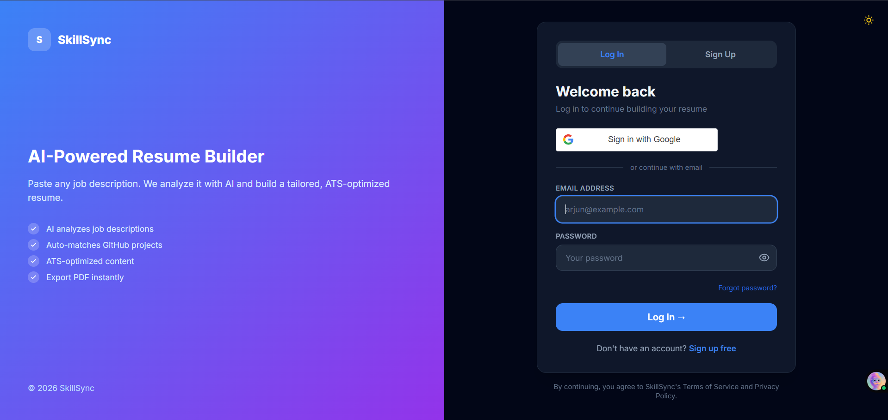
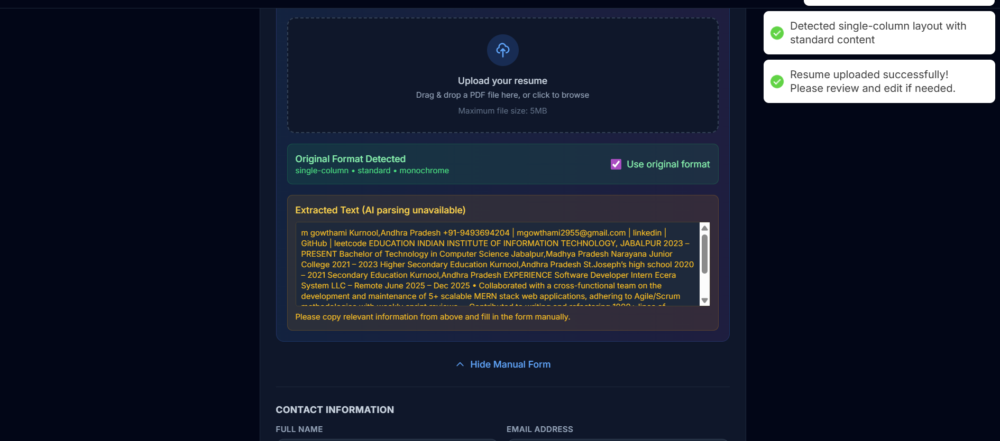
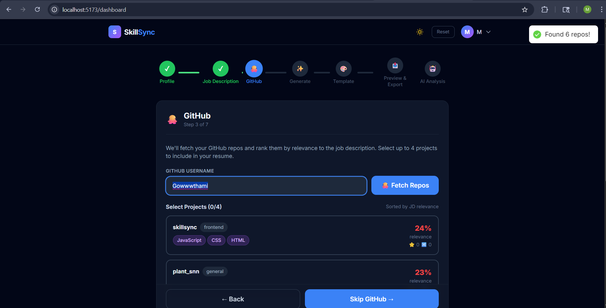
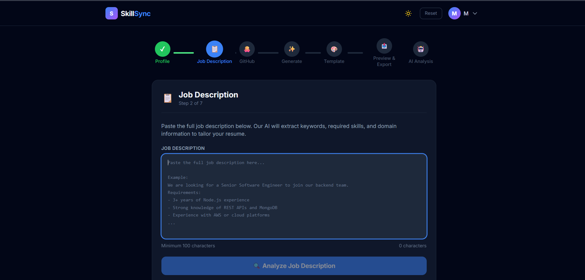
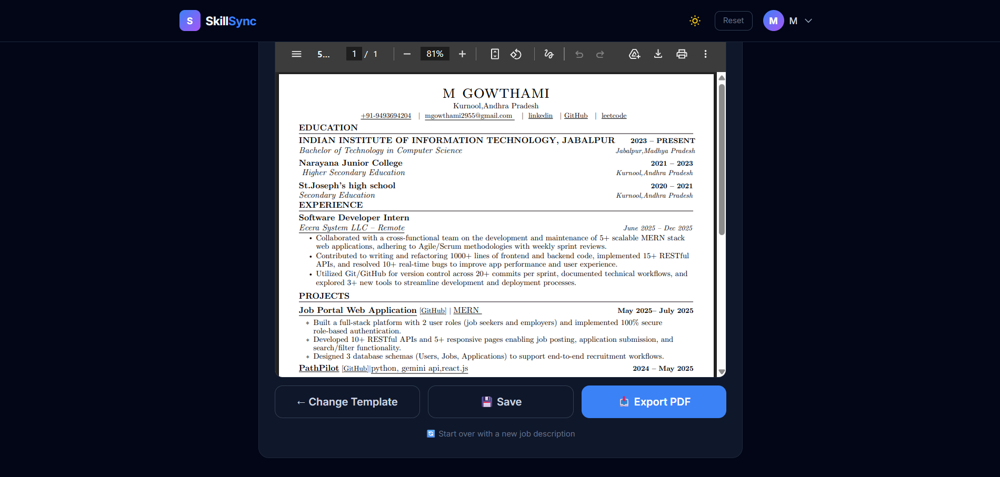

# SkillSync

SkillSync is an AI-powered resume builder that helps users tailor resumes to a job description, fetch relevant GitHub projects, generate ATS-focused content, and export polished PDFs.

## Highlights

- Multi-step resume workflow: profile, JD analysis, GitHub enrichment, generation, template selection, preview, and AI analysis.
- ATS-oriented content improvements using multiple AI providers.
- GitHub project fetch and ranking to include relevant work in resumes.
- Resume upload support with extracted text and original-format detection.
- PDF preview and export flow in-app.
- Authentication with email/password and Google sign-in.

## Screenshots

### Login



### Job Description Step



### GitHub Projects Step



### Resume Upload and Parsing



### Preview and PDF Export



## Tech Stack

### Frontend

- React 19
- Vite
- Tailwind CSS
- React Router
- React Hot Toast

### Backend

- Node.js + Express
- MongoDB + Mongoose
- JWT authentication
- Google OAuth (Passport)
- Multer + PDF parsing

### AI/Scoring Engines

- Groq
- Gemini
- Hugging Face
- GitHub analysis services

## Repository Structure

```text
skillsync/
  backend/     Express API, auth, resume/JD/GitHub services
  frontend/    React app and resume builder UI
  docs/        Project documentation assets (screenshots)
```

## Quick Start

### 1) Prerequisites

- Node.js 18+
- npm 9+
- MongoDB instance (local or Atlas)

### 2) Install dependencies

```bash
# from repository root
cd backend
npm install

cd ../frontend
npm install
```

### 3) Configure environment variables

Create these files:

- backend/.env
- frontend/.env

Backend example (backend/.env):

```env
PORT=5000
MONGODB_URI=mongodb+srv://<user>:<password>@<cluster>/<db>
JWT_SECRET=replace_with_a_strong_secret
JWT_EXPIRES_IN=7d

# optional but recommended
NODE_ENV=development
APP_NAME=SkillSync
CORS_ORIGIN=http://localhost:5173

# GitHub and AI
GITHUB_TOKEN=
GROQ_API_KEY=
ANTHROPIC_API_KEY=

# Google OAuth
GOOGLE_CLIENT_ID=
GOOGLE_CLIENT_SECRET=
GOOGLE_CALLBACK_URL=http://localhost:5000/api/auth/google/callback

# Email
SMTP_HOST=smtp.gmail.com
SMTP_PORT=587
SMTP_USER=
SMTP_PASS=
```

Frontend example (frontend/.env):

```env
VITE_API_URL=http://localhost:5000/api
VITE_GOOGLE_CLIENT_ID=
VITE_GROQ_KEY=
VITE_GEMINI_KEY=
VITE_HUGGINGFACE_KEY=
```

### 4) Run the app

Open two terminals.

Terminal 1 (backend):

```bash
cd backend
npm run dev
```

Terminal 2 (frontend):

```bash
cd frontend
npm run dev
```

Then open http://localhost:5173.

## Available Scripts

Backend (in backend):

- npm run dev - start API with nodemon
- npm start - start API with node

Frontend (in frontend):

- npm run dev - start Vite dev server
- npm run build - production build
- npm run preview - preview production build
- npm run lint - run ESLint

## API Overview

The backend exposes routes under /api:

- /api/auth
- /api/users
- /api/jd
- /api/resumes
- /api/github
- /api/health

## Notes

- CORS currently allows localhost ports 5173, 5174, 3000, and the deployed frontend URL.
- In development, rate limiting is relaxed; production limits are stricter.

## License

Add a license file (for example, MIT) if you plan to distribute this repository publicly.
